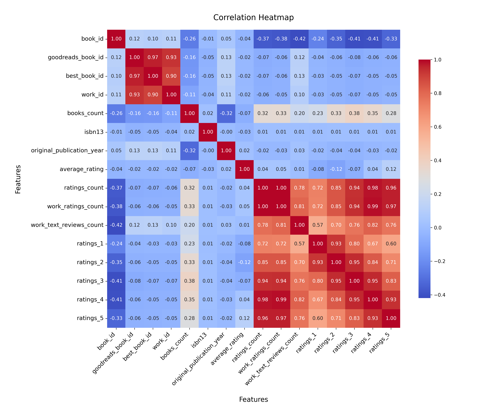
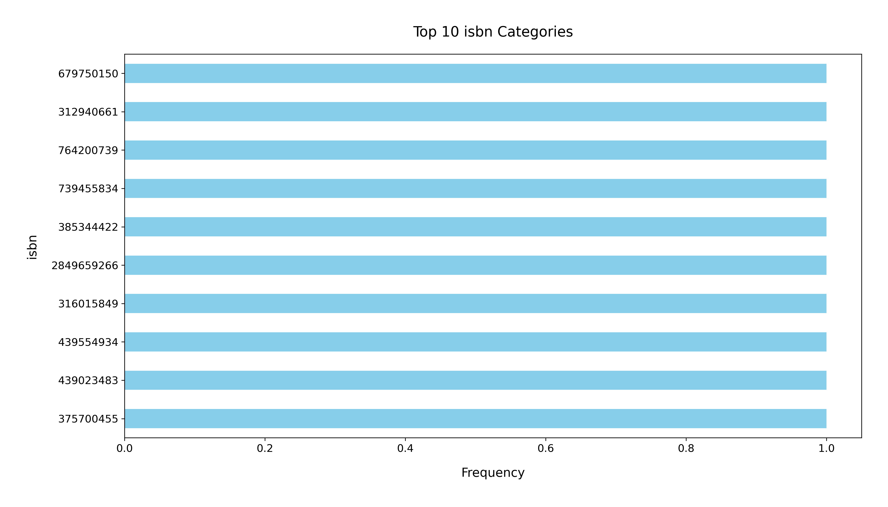

# Analysis Report

### Summary of the Goodreads Dataset

The dataset contains information about 10,000 books as recorded on Goodreads, comprising 23 columns that include various attributes such as book IDs, authors, publication years, ratings, and review counts. The data is fairly comprehensive, but there are some notable missing values in a few key fields.

#### Key Insights

1. **Missing Values**: 
   - The dataset has missing values primarily in the `isbn`, `isbn13`, `original_publication_year`, and `original_title` fields. There are 700 missing ISBNs, 585 missing ISBN13s, and 21 missing publication years. These missing values could hinder analysis related to book identification and publication trends.

2. **Authors**: 
   - The dataset features a diverse array of authors, with a total of 4,664 unique authors. Stephen King is the most prolific author, featured in 60 titles, indicating a strong presence of popular authors in the dataset.

3. **Publication Year Trends**: 
   - The average original publication year is 1982, with a range from -1750 to 2017. This suggests that the dataset includes both classic and contemporary literature. The distribution of publication years could be explored further to analyze trends in book popularity over time.

4. **Ratings and Reviews**: 
   - The average rating across all books is approximately 4.00, with ratings ranging from 2.47 to 4.82. The ratings distribution appears to be skewed towards the higher end, indicating that users generally rate books favorably.
   - The average number of ratings is 54,000, with a maximum of over 4.7 million ratings for a single book, highlighting the popularity of certain titles.

5. **Language Distribution**:
   - The majority of books are in English (with `language_code` 'eng' appearing 6,341 times), pointing to a potential bias in language representation. This could limit the dataset's applicability for non-English literature analysis.

6. **Image Availability**:
   - The dataset includes URLs for both full-sized and small images of book covers, which could be useful for visualizations or applications needing cover art.

#### Recommendations

1. **Data Cleaning**: 
   - Address the missing values, particularly in critical fields like `isbn` and `original_publication_year`, to enhance data integrity. Imputation techniques or removal of incomplete records may be considered.

2. **Further Analysis of Ratings**:
   - Conduct a more detailed analysis of the ratings distribution to identify trends or patterns among different genres, authors, or publication years. Visualizations such as histograms could effectively display this information.

3. **Author Popularity Insights**: 
   - Investigate the relationship between the number of books by an author and their average ratings to determine if prolific authors also receive higher ratings.

4. **Language Diversity**: 
   - Explore the inclusion of books in other languages to enrich the dataset and provide a more comprehensive view of global literature. This could involve seeking additional datasets or expanding the criteria for data collection.

5. **Visual Enhancements**: 
   - Utilize the image URLs to create a visual representation of the dataset, which could be beneficial for presentations or web applications focused on book discovery.

In conclusion, while the dataset offers a robust foundation for analyzing literature trends on Goodreads, addressing missing data, expanding language representation, and utilizing visualizations can significantly enhance the insights derived from this dataset.

