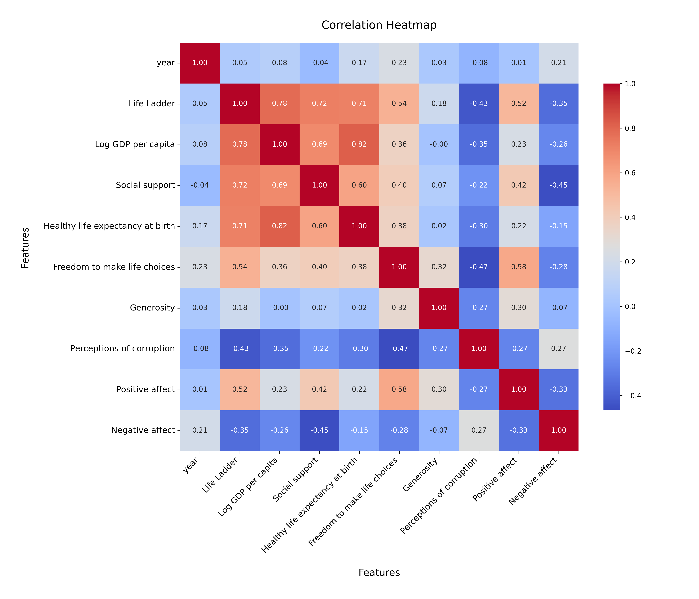
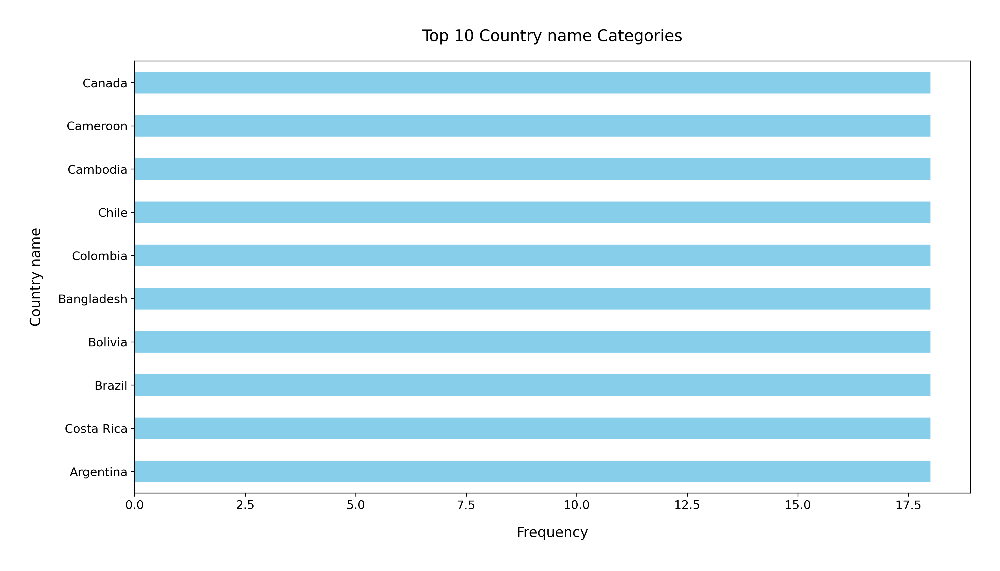

# Analysis Report

### Summary of the Dataset

The dataset `happiness.csv` comprises 2,363 rows and 11 columns, detailing various factors associated with happiness across different countries and years. The primary columns include 'Country name', 'year', and several metrics like 'Life Ladder', 'Log GDP per capita', and measures of social support, health, freedom, generosity, and perceptions of corruption.

**Missing Values:**
- The dataset contains varying amounts of missing values across different columns:
  - **Generosity** has the most significant missing data (81 entries).
  - Other columns with notable missing values include 'Perceptions of corruption' (125), 'Freedom to make life choices' (36), and 'Healthy life expectancy at birth' (63).

**Summary Statistics:**
- The mean 'Life Ladder' score is approximately **5.48**, indicating a moderate level of happiness across the dataset.
- The average 'Log GDP per capita' is around **9.40**, suggesting a relatively high level of economic development.
- 'Social support' has a mean value of **0.81**, indicating that individuals generally feel supported in their social networks.
- **Generosity** appears to be very low on average (mean of **0.0000977**), which could be an area for further investigation.
  
### Key Insights

1. **Happiness and Economic Factors:**
   - There is a positive correlation between 'Life Ladder' and 'Log GDP per capita'. Countries with higher GDP per capita tend to report higher happiness levels.
   - This relationship suggests that economic prosperity is a significant contributor to overall happiness.

2. **Importance of Social Support:**
   - The average score for 'Social support' is relatively high, indicating that social connections play a crucial role in determining happiness.
   - Countries may benefit from policies that strengthen community ties and support systems.

3. **Impact of Freedom and Corruption:**
   - The average 'Freedom to make life choices' score is **0.75**, which suggests that personal freedoms positively impact happiness. 
   - Conversely, the perception of corruption has a mean score of **0.74**. Higher happiness levels are often associated with lower perceived corruption.

4. **Generosity and Affective Measures:**
   - The low mean for 'Generosity' and the relatively moderate levels of 'Positive affect' (mean **0.65**) and 'Negative affect' (mean **0.27**) highlight potential areas for improvement in emotional well-being and charitable behaviors.

### Recommendations

1. **Targeted Economic Policies:**
   - Governments should focus on economic growth strategies that not only increase GDP but also distribute wealth more equitably to enhance overall happiness.

2. **Enhancing Social Support Systems:**
   - Initiatives aimed at fostering community engagement and support networks can help improve social ties, which are essential for enhancing the overall happiness of citizens.

3. **Improving Personal Freedoms:**
   - Policymakers should strive to enhance personal freedoms and reduce corruption to increase citizens' happiness levels, as these factors strongly influence perceived well-being.

4. **Encouraging Generosity:**
   - Programs that promote charitable actions and community service could help raise the average generosity score, fostering a culture of giving and improving overall happiness.

5. **Monitoring Emotional Well-being:**
   - Regular assessments of positive and negative affect can help identify trends in mental health and emotional well-being, allowing for timely interventions.

By addressing these areas, countries can work towards improving the happiness and satisfaction of their populations, leading to a more stable and content society.

