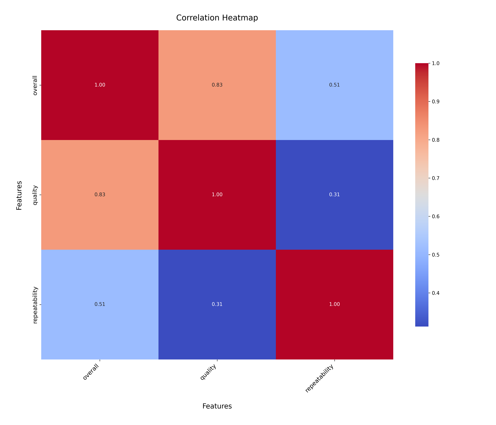
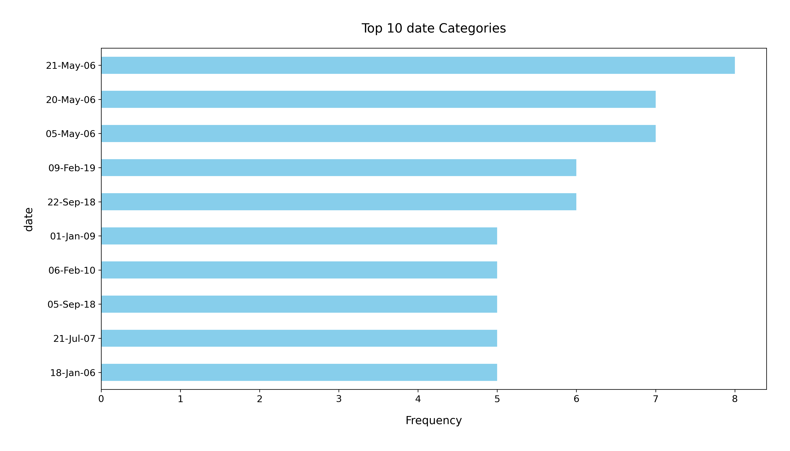

# Analysis Report

### Summary of the Dataset

The dataset `media.csv` contains information on 2,652 entries with 8 columns detailing media content. The key columns include `date`, `language`, `type`, `title`, `by`, `overall`, `quality`, and `repeatability`. The dataset has some missing values, particularly in the `date` column (99 missing) and the `by` column (262 missing). 

### Key Insights

1. **Missing Values**:
   - The `date` column has 99 missing entries, which could hinder temporal analysis.
   - The `by` column has a significant number of missing values (262), indicating that many entries do not specify the creator or author.

2. **Language Distribution**:
   - The dataset contains 11 unique languages, with English being the most frequent (1,306 occurrences). This suggests a potential bias towards English-language media in the dataset.

3. **Media Type**:
   - The dataset includes 8 unique media types, with 'movie' being the most prevalent (2,211 occurrences). This indicates a focus on film-related entries.

4. **Title Variety**:
   - There are 2,312 unique titles, suggesting a diverse range of content. The title 'Kanda Naal Mudhal' appears most frequently (9 times), indicating it might be a popular or notable entry.

5. **Ratings Overview**:
   - The `overall` rating has a mean of approximately 3.05 with a standard deviation of 0.76, indicating that most entries receive average ratings.
   - The `quality` rating has a mean of about 3.21 and a standard deviation of 0.80, suggesting a slightly higher quality perception.
   - The `repeatability` metric has a mean of approximately 1.49, suggesting that repeat viewing may not be very common, as the majority of entries score low on this metric (most entries score either 1 or 2).

### Recommendations

1. **Data Cleaning**:
   - Address the missing values in the `date` and `by` columns. Consider investigating why these values are missing and whether they can be filled in or if rows should be removed.

2. **Expand Language Representation**:
   - If the objective is to analyze global media, consider incorporating more non-English entries to provide a more comprehensive view of media across different cultures.

3. **Focus on Popular Media**:
   - Analyze the titles and types of media that receive higher ratings. This could inform future content creation or curation strategies.

4. **Temporal Analysis**:
   - With many entries missing dates, efforts should be made to fill these gaps to allow for time-based trends and analyses. This could provide insights into the media's evolution over time.

5. **User Engagement**:
   - Investigate the reasons behind the low repeatability scores. Engaging with users to understand their viewing habits could help improve content retention strategies.

### Visual Representations

- **Bar Charts**: Create bar charts to visualize the distribution of media types and languages.
- **Box Plots**: Use box plots to illustrate the spread of overall, quality, and repeatability ratings, highlighting any outliers or trends.
- **Heatmaps**: Consider a heatmap to show the correlation between `overall`, `quality`, and `repeatability` ratings to identify any patterns.

In summary, while the dataset presents a wealth of information about media, addressing the missing data and expanding the scope of analysis will enhance its utility and insights.

